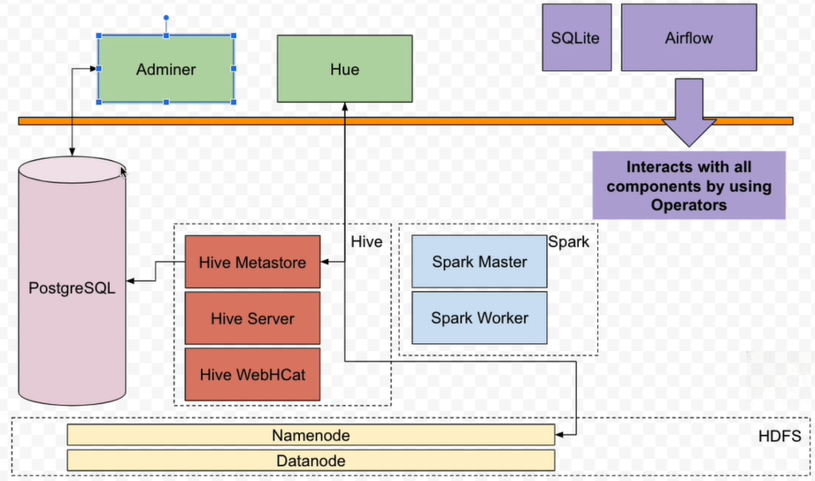

# Airflow

Airflow is a tool for scheduling processes, usually used by Data Engineering teams. This repository has been created from the classes available at [Apache Airflow: The Hands-On Guide](https://gympass.udemy.com/course/the-ultimate-hands-on-course-to-master-apache-airflow/).

## First Project

This project has the objective of presenting Airflow features using a simple and common architecture called ELT (Extract, Load and Transform) using HDFS (Storage), Hive (Table), Spark (Data Processing).

